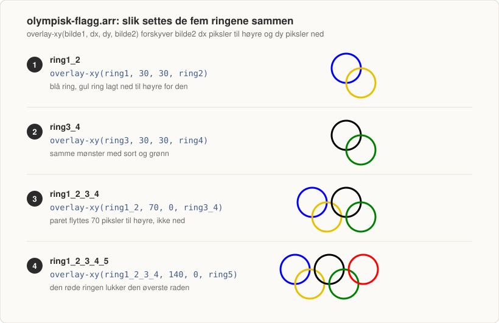

# blackbeard

Pyret-oppgaver fra IS-114 ved Universitetet i Agder, høsten 2024. Tre frittstående filer som hver
dekker sitt tema: funksjoner med enhetstester, bildebygging, og tabellbehandling mot et
Google-regneark.

Alle funksjoner er dokumentert med `doc:` og testet i `where:`-blokker i selve filen.



## Kjøre koden

Filene kjøres på [code.pyret.org](https://code.pyret.org). Åpne en `.arr`-fil der og trykk **Run**.
Da kjøres også alle `where:`-blokkene som tester.

`struktur.arr` krever i tillegg at du er logget inn med en Google-konto som har lesetilgang til
regnearket funksjonene henter data fra. Første kjøring ber om tilgang til Google Drive.

## Struktur

| Fil | Tema |
|-----|------|
| `konvert.arr` | Valutakonvertering: funksjoner, betingelser og `raise` |
| `olympisk-flagg.arr` | Det olympiske flagget bygget av sirkler med bildebiblioteket |
| `struktur.arr` | Tabeller fra Google Sheets: filtrering, sortering, statistikk og diagram |
| `dummydata.xlsx` | Datasettet `struktur.arr` leser, klart til opplasting i Google Sheets |
| `images/` | Diagrammer som hører til denne README-en |

## konvert.arr

Konverterer norske kroner til euro og dollar. Kursene er hardkodet slik de sto 31. august 2024
(`0.085` for euro, `0.095` for USD).

| Funksjon | Beskrivelse |
|----------|-------------|
| `nok-til-euro(nok)` | Kroner til euro |
| `nok-til-usd(nok)` | Kroner til dollar |
| `nok-til-joker(nok, valg)` | Kroner til euro eller dollar, avhengig av `valg` |

`nok-til-joker` tar valutaen som en streng, `"euro"` eller `"usd"`. Alt annet gir
`raise("Valuta må vær 'euro' eller 'usd'")`.

## olympisk-flagg.arr

Bygger det olympiske flagget av fem ringer med `circle` og `overlay-xy`. Diagrammet øverst i
denne filen viser stegene.

| Funksjon | Beskrivelse |
|----------|-------------|
| `konvert-flagg(ring1, ring2, ring3, ring4, ring5)` | Tar fem farger og setter sammen ringene til ett bilde |
| `olympisk-flagg(valg)` | Kaller `konvert-flagg` med et ferdig fargesett |

Ringene settes sammen parvis: `ring1` og `ring2` forskyves 30 piksler i begge retninger slik at de
overlapper på skrå, det samme gjøres med `ring3` og `ring4`, og de to parene legges ved siden av
hverandre med 70 pikslers forskyvning før den femte ringen legges til på 140.

`olympisk-flagg` tar `"farget"` for de fem offisielle fargene (blå, gul, sort, grønn, rød) eller
`"monokrom"` for fem sorte ringer. Alt annet gir `raise`.

## struktur.arr

Laster et Google-regneark med `load-spreadsheet` og arket `o1-oppg3` inn i en tabell med kolonnene
`id`, `first_name`, `last_name`, `email`, `gender`, `ip_address` og `age`. Datasettet ligger i
`dummydata.xlsx`: 10 rader, med fanen og kolonnene navngitt akkurat slik koden venter.

| Funksjon | Beskrivelse |
|----------|-------------|
| `filtrer_alder()` | Henter navn og alder, filtrerer på alder og bytter alderskolonnen mot et fødselsår |
| `yngste_eldste(valg)` | Gir fullt navn og e-post for den yngste eller eldste i tabellen |
| `gsnitt()` | Gjennomsnittsalderen for hele tabellen |
| `navn_alder_chart()` | Søylediagram med navn på X-aksen og alder på Y-aksen |

`filtrer_alder` bruker `select` for å hente ut `first_name` og `age`, `sieve` for å filtrere på
alder, og `extend` for å regne om alder til fødselsår (`2024 - age`). Alderskolonnen fjernes til
slutt med `drop`, siden fødselsåret erstatter den.

`yngste_eldste` sorterer tabellen på alder, synkende for `"yngste"` og stigende for `"eldste"`,
og plukker siste rad. Alt annet enn `"yngste"` og `"eldste"` gir `raise`.

`gsnitt` bruker `T.running-mean` fra `tables` til å legge på en kolonne med løpende gjennomsnitt,
og leser av siste rad. `navn_alder_chart` slår sammen fornavn og etternavn til en kolonne med
`extend` og tegner et søylediagram med `from-list.bar-chart`.

### Sette opp regnearket

Filen leser ikke `dummydata.xlsx` fra disk. `load-spreadsheet` tar IDen til et regneark som ligger
i Google Sheets, så datasettet må lastes opp først:

1. **Last opp filen.** Gå til [drive.google.com](https://drive.google.com), velg **Ny**, deretter
   **Filopplasting**, og velg `dummydata.xlsx`.
2. **Konverter til Google Sheets.** Åpne filen i Drive og velg **Fil**, deretter **Lagre som
   Google Regneark**. `load-spreadsheet` leser bare Google sitt eget format, ikke selve
   xlsx-filen. Drive gjør dette automatisk hvis du har slått på konvertering ved opplasting.
3. **Sjekk arkfanen.** Koden slår opp fanen med
   `dummy-sheet.sheet-by-name("o1-oppg3", true)`, så fanen må hete `o1-oppg3`. Den heter allerede
   det i `dummydata.xlsx`, så her er det bare å bekrefte at navnet fulgte med opplastingen. Blir
   fanen døpt om under konverteringen, høyreklikk på den nederst og velg **Gi nytt navn**.
   Argumentet `true` betyr at første rad er overskrifter.
4. **Kopier IDen fra adressefeltet.** URLen til et åpent regneark ser slik ut:

   ```
   https://docs.google.com/spreadsheets/d/1RYN0i4Zx_UETVuYacgaGfnFcv4l9zd9toQTTdkQkj7g/edit#gid=0
   ```

   IDen er strengen mellom `/d/` og neste skråstrek, altså
   `1RYN0i4Zx_UETVuYacgaGfnFcv4l9zd9toQTTdkQkj7g`. Den samme IDen finner du under **Fil**,
   deretter **Del**, deretter **Kopier lenke**.
5. **Lim IDen inn i koden.** Første linje i `struktur.arr` blir da:

   ```
   dummy-sheet = load-spreadsheet("din-id-her")
   ```

6. **Kjør filen.** Første kjøring åpner et Google-vindu som ber om tilgang til Drive. Godkjenn
   med kontoen som eier regnearket. Ligger arket på en annen konto, må det deles med kontoen du
   er logget inn med på code.pyret.org.

Deklarasjonen i `load-table` speiler arket: alle kolonnene i arket må stå der, i samme
rekkefølge og med riktig type, også de ingen funksjon bruker. Ellers stopper Pyret med en feil om
kolonnenavn eller antall kolonner. `dummydata.xlsx` er satt opp slik at dette stemmer fra første
kjøring, uten å endre en linje i `struktur.arr`.

## Merknader

- Av de sju kolonnene i `load-table` er det bare `first_name`, `last_name`, `email` og `age` som
  faktisk leses. `id`, `gender` og `ip_address` står der bare fordi det originale arket hadde dem,
  og forekommer ingen andre steder i filen.
- Innholdet i `dummydata.xlsx` er lagt opp etter `where:`-blokkene i `struktur.arr`. Alderne gir
  fodselsdatoene testene venter, gjennomsnittet blir 55.9, og `Delila Tackes` og `Aretha Marconi`
  er yngst og eldst. `ip_address` er lagret som tall, ikke som `12.34.56.78`, fordi `load-table`
  deklarerer kolonnen som `Number`.
- `York Sarjeant` og `Aretha Marconi` er begge 86 år, siden begge skal gi fodselsdato 1938. Testen
  for `"eldste"` venter `Aretha Marconi`, og det forutsetter at sorteringen beholder radrekkefølgen
  ved lik alder. Derfor må Aretha ligge etter York i arket.
- Testen `nok-til-joker(10, "yen") is 137.75` i `konvert.arr` er ment å teste at funksjonen kaster
  feil, men er skrevet som en vanlig likhetstest. Pyret tester dette med `raises` i stedet:
  `nok-til-joker(10, "yen") raises "Valuta"`.
- Filteret i `filtrer_alder` er `(age <= 80) or (age >= 30)`, som slipper gjennom alle rader. `and`
  ville filtrert på aldersspennet 30 til 80 år, som antakelig var meningen, men `where:`-blokken
  venter alle de 10 navnene. Endres operatoren, ryker testen.
